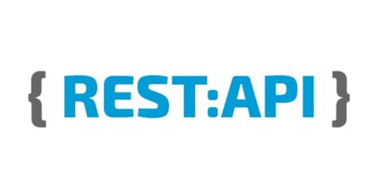

# **Introduction**

Hi there, I'm **Neil** from Sydney, Australia.

I am passionate about web development and most recently have been focusing on full MERN stack and react.

You can view my portfolio and featured repos below.

 
 

## **Stack** 
I am agnostic about which technologies and languages I use. In the past I have experienced many different ones and I'm always keen to try something new, but my focus is currently on **HTML**, **CSS**, **JavaScript**, and the MERN stack **MongoDB**, **Express.js**, **React.js**, and **Node**.

 

### **Technologies**
HTML CSS JavaScript MongoDB Express React NodeJS

   &emsp;
   &emsp;
   &emsp;
   &ensp;
   &ensp;
   &emsp;
   &ensp;

 
 

### **Tools**
NPM Git Github Postman Figma VsCode

   &ensp;
   &emsp;
   &ensp;
   &emsp;
   &emsp;
   &emsp;

 
 

### **Deployment** 
AWS Netlify Heroku

   &ensp;
   &emsp;
   &ensp;

 
 

## **My Portfolio website**

 

## **Links**

<!--  &ensp;
[My portfolio website](https://www.neilrigg.com "My portfolio website") -->

 &emsp;

[LinkedIn](https://www.linkedin.com/in/neil-rigg-794243159/ "Linked In")

<!--  -->

 
 

## **Featured Projects**
I am consistantly working on projects with the goal of gaining a deeper knowledge of the technologies of the MERN stack and the underlying prinicples of the web. 

You can jump to some of them on Github here...
More information about these can be found on my portfolio website [neilrigg.com](https://www.neilrigg.com/ "neilrigg.com")

<!-- 
### My LIVE portfolio website  ### -->

 

### My portfolio website on Github ###

 
 

### Administration frontend for my portfolio site ###

 
 

### Backend API for portfolio site (consumed by portfolio site and administration) ###

 
 

### React budget app (in progress) ###

 
 

## **Currently Working on**

